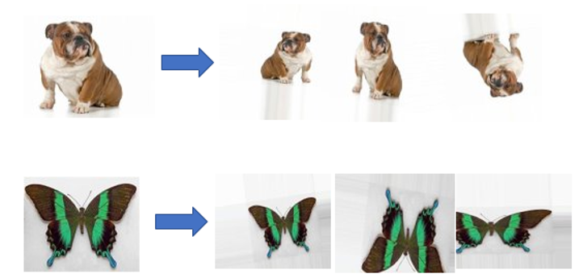
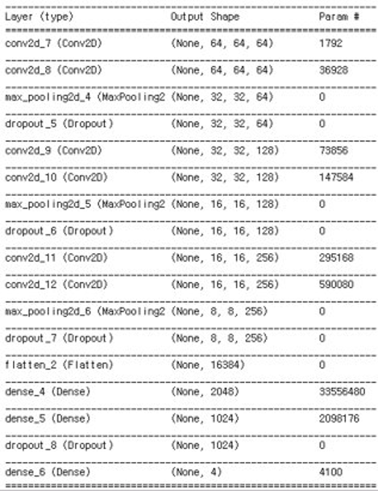
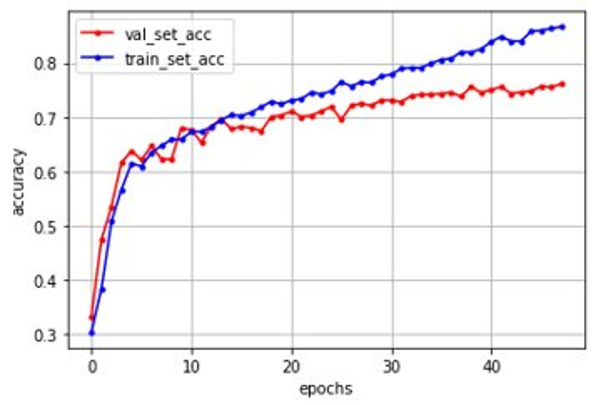

# image_classifier
## 1. 프로젝트 소개
  - 딥러닝에서 사용되는 CNN(Convolutional Neural Network)을 사용
  - 개, 고양이, 말, 나비를 구분하는 이미지 분류기 구현
## 2. 개발 환경
  - 사용 언어 : Python
  - 환경 : Google Colab & Keras 라이브러리 활용
## 3. 실행 화면

- 데이터 샘플개수가 부족하여 이미지를 회전시키거나 확대하여 개수를 늘리는 데이터 aumentation 과정입니다.
---

- CNN을 기반으로 입력 데이터의 특성에 맞게 Neural Network를 구성하였습니다.
- 딥러닝 라이브러리인 Keras를 활용하였습니다.
---

- Epochs(반복횟수)가 늘어날수록 Accuracy(정확도)가 향상되는 것을 알 수 있습니다.
- 최종 테스트 결과 정확도는 76%로 확인되었습니다.
